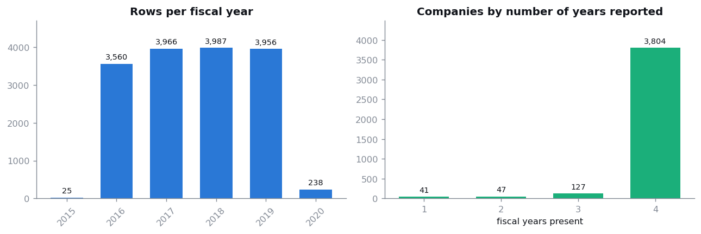
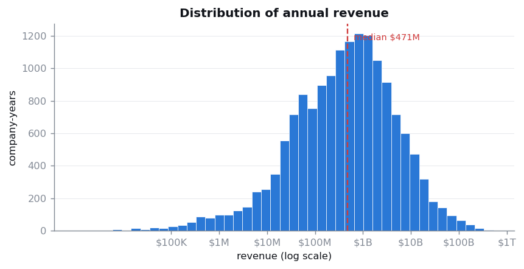
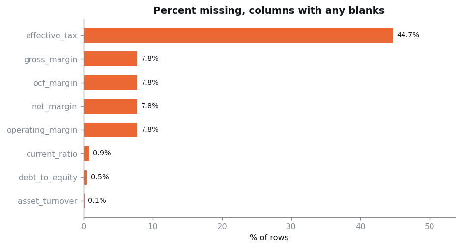
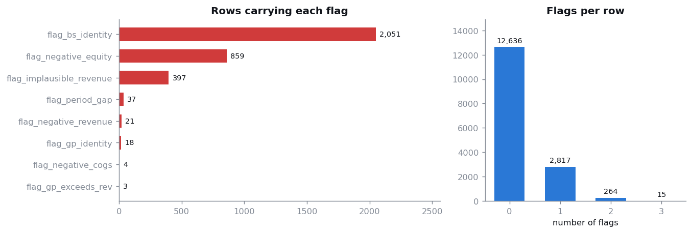
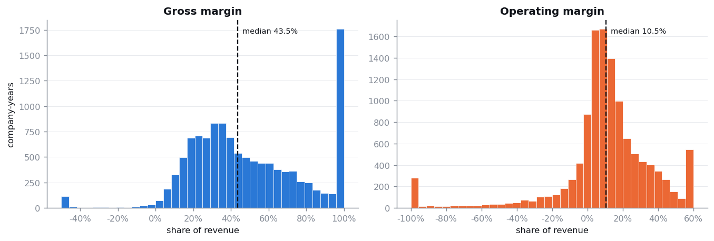
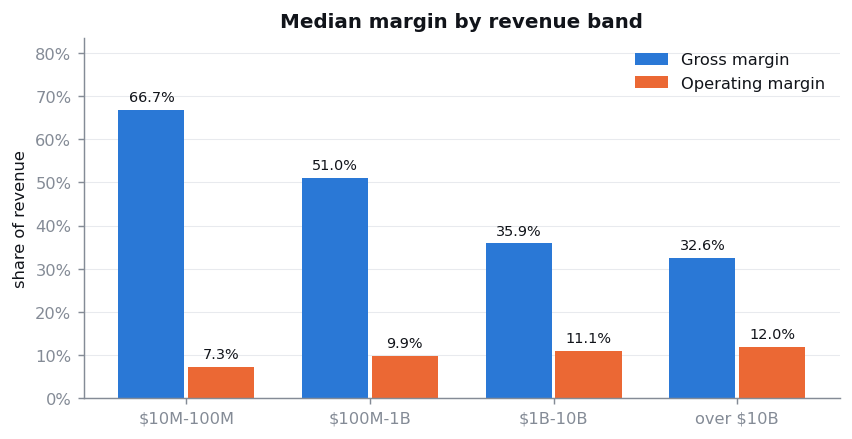
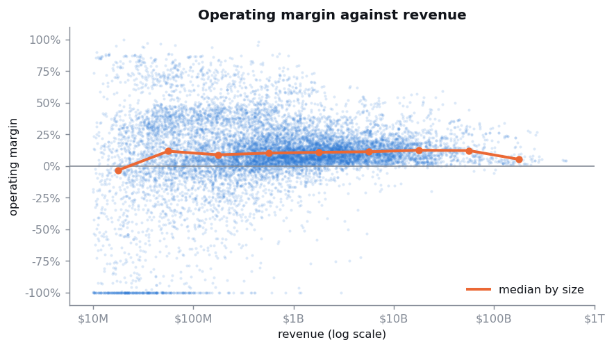
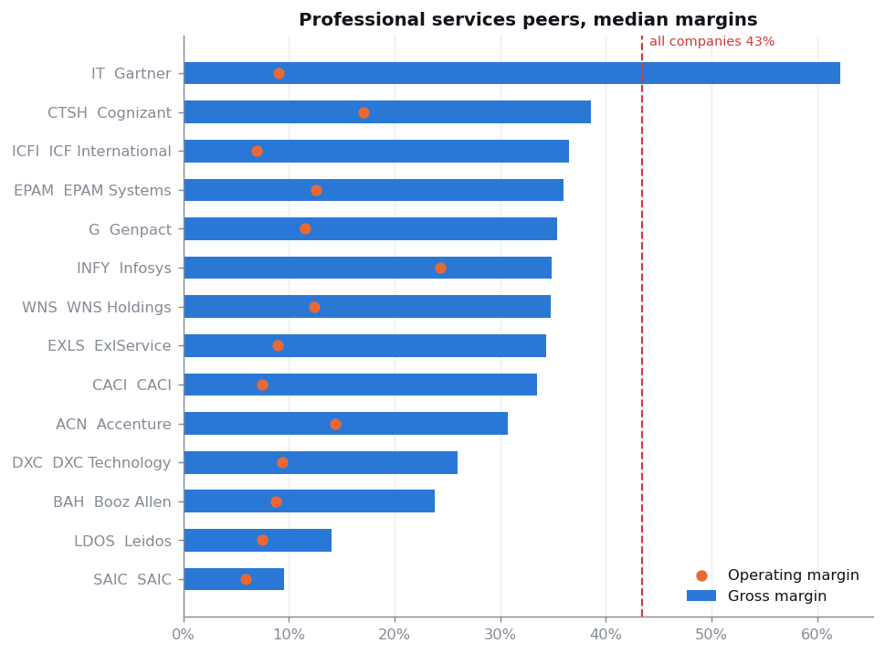
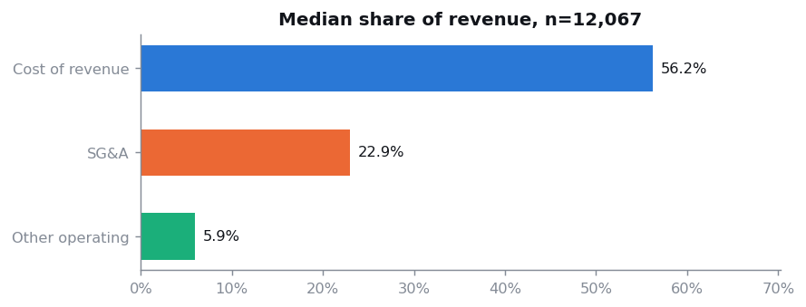

# Arkamark 1A - EDA

Generated by `eda.py` on 2026-09-24 10:16. Read-only: this script never modifies `data/clean/`.

## 1. What am I looking at

This file is one row per company per fiscal year. It is NOT Arkamark data. Arkamark has given us none. These are filed financial statements for real listed companies from a public Kaggle dataset, standing in until Arkamark's own figures arrive. ACN is Accenture, AZO is AutoZone. Anything we find here is true about those companies and says nothing about Arkamark without an argument that they are comparable.

The file has 15,732 rows covering 4,019 companies and 38 columns. Every money figure is in whole US dollars, so 4202000000 means $4.2 billion.

12,267 of those rows (78%) survive the recommended filter, which drops rows carrying an error flag or marked margin_unreliable. Use that subset for anything you plan to report.

## 2. How much history do we have

*Coverage: four years, and that is the ceiling.*

3,804 of 4,019 companies have exactly 4 fiscal years. Nothing has more.

THIS IS THE BIGGEST CONSTRAINT ON THE PROJECT. The brief asks for a two-year forecast. You cannot fit a time-series model per company on four points. Whatever we build has to pool information across companies, or forecast at an aggregate level, or both. Say this out loud in the presentation rather than letting a reviewer find it.

The small counts at either end are fiscal years that end in odd months rather than December. Exclude them from year-on-year comparisons.

## 3. How big are these companies

*Revenue on a log scale. The raw scale is unreadable.*

Revenue runs from under a million dollars to $524 billion. The median company-year books $471 million.

WHY THE LOG SCALE. On a normal axis every bar would be crushed against zero by a handful of giants. Taking log10 turns 'ten times bigger' into 'one step right', which is the only way a distribution spanning six orders of magnitude is readable. Use a log scale whenever your data spans orders of magnitude, and always label the ticks in real units like this rather than leaving them as 6, 7, 8.

This spread is also why a single pooled average is meaningless here, and why the pipeline refuses to compute a margin when revenue is tiny.

## 4. Where the blanks are

*All blanks sit in derived ratios, never in raw figures.*

30 of 38 columns have no blanks whatsoever: every raw financial figure, every flag, every key. All the blanks are in the 8 derived ratio columns.

THE IMPORTANT IDEA. A blank ratio here is a refusal to divide, not a missing input. Every input to a blank margin is present in the same row. The pipeline declines to divide when the denominator is too small to produce a meaningful percentage, because a margin computed on $40,000 of revenue is noise with a percent sign on it.

effective_tax is the extreme case at 44.7%. Roughly three quarters of those blanks are companies that lost money that year, and a tax rate on a loss is meaningless. Do not describe this column as 'missing data' in the write-up. Describe it as not applicable.

DO NOT fill these with a mean or a median. In financial statements a blank usually means the line item does not apply to that company. Filling it invents a company that does not exist.

## 5. What the error flags caught

*Flagged rows are marked and kept, never deleted.*

12,636 rows carry no flag at all. The rest carry one or more. Nothing is deleted: the cleaning layer marks problems and leaves the decision to you, because deleting rows is invisible and permanent and you may be asking a different question than the person who cleaned.

TWO OF THESE ARE NOT ERRORS. flag_negative_equity describes a real financial condition, normal in heavily leveraged companies. flag_implausible_revenue is a judgement about whether shells belong in your sample. The other six are arithmetic that cannot be true, like gross profit exceeding revenue.

UNEXPLAINED, AND UNCLAIMED. flag_bs_identity fires on 2,051 rows. Assets do not equal liabilities plus equity. The rate is flat across years (13.5%, 13.4%, 12.9%, 12.8%), which points at a convention in the source data rather than an event. Nobody has checked whether it clusters by size or company type. This is a finding sitting unclaimed in our own output.

## 6. What a normal margin looks like

*Clean subset. End bars include everything beyond the axis.*

On the clean subset the median company keeps 43.5% of revenue after direct costs, and 10.5% after all operating costs.

ALWAYS REPORT THE MEDIAN HERE, NOT THE MEAN. On the clean subset the gross margin mean is 48.4% against a median of 43.5%. Both distributions have a long left tail of loss-makers that drags a mean around. On the UNFILTERED table a mean is off by orders of magnitude.

The pile-up at 100% gross margin is not an error. It is the companies reporting zero cost of revenue: banks, insurers, REITs and some software firms. They genuinely have no COGS line. Exclude them before benchmarking a services firm.

## 7. The finding: margins move with company size

*Gross margin falls with size; operating margin rises.*

Gross margin falls from 66.7% to 32.6% as companies get bigger, while operating margin rises from 7.3% to 12.0%. They move in opposite directions.

WHY THIS MATTERS FOR US. Part of it is real operating leverage: overhead spread over more revenue. Part of it is composition, since smaller firms here are more often service and software businesses that report little or no cost of revenue. Either way, benchmarking a firm against the whole pool is wrong twice over, once for sector and once for size. This is the first result in the project that is an actual finding rather than data housekeeping.

## 8. Size against profitability, one dot per company-year

*Each dot is one company-year. Orange is the running median.*

HOW TO READ THIS. Each faint dot is one company in one year. With twelve thousand overlapping points a scatter turns into a smudge, so two things fix it: low opacity, which turns density into darkness, and the orange running median, which is the signal you actually want.

The spread narrows as revenue grows. Small companies range from heavy losses to high profits; large ones cluster in a tight band near ten percent. Big companies are more predictable, which is convenient, because forecasting is easier where variance is low.

THAT SOLID LINE OF DOTS ALONG THE BOTTOM is not a data artifact. It is 264 company-years whose operating margin is worse than -100%, squashed onto the axis by the clip. Companies spending more than twice their revenue. They are real rows and they are all small. If we had not clipped, the y-axis would run to -800% and the rest of the chart would be an unreadable stripe. Clipping is the right call here, but say that you did it.

## 9. Picking a peer group by hand

*Hand-picked peer group against the full universe.*

Peer median gross margin is 34.5% against 43.5% for the whole universe. Using the pooled number would overstate gross margin by about 9 percentage points.

WHY THIS IS HAND-PICKED. There is no sector, industry, SIC or country column anywhere in this source, so a peer group cannot be selected programmatically. These 14 tickers were chosen by eye. That is a weakness and it belongs in the limitations section. Somebody should validate the list against SIC codes from yfinance and write down the inclusion rule they used.

## 10. Where each revenue dollar goes

*Independent medians. Shown as separate bars because they do not sum.*

Median cost of revenue is 56.2% of revenue, SG&A is 22.9%, and the unexplained operating residual is 5.9%. These three ratios are what the P&L engine needs.

WHY THREE BARS AND NOT A STACKED BAR. These are independent medians and they do not sum to 100%. The median company for cost of revenue is not the median company for SG&A. A stacked bar would imply they add up and would be wrong. This is a small honesty decision that reviewers notice.

The 'other operating' residual exists because total operating expenses do not decompose into COGS plus SG&A plus R&D on about half the rows. Carry it explicitly so the projected statement always ties out instead of quietly losing money.

## 11. What to do with this

FIVE OPEN ITEMS, none of them owned yet. Each is bounded and each produces something presentable.

1. **Evaluation** - Work out why the balance sheet fails on 13% of rows. Check whether it clusters by size, year-end month or company type.

2. **P&L engine** - Validate the hand-picked peer list against SIC codes and write down the inclusion rule.

3. **Data pipeline** - Write 05_audit_identities.R so the accounting identity checks run on every build instead of ad hoc.

4. **Modeling** - Defend or lower the $10M pretax floor on effective_tax. Test $1M and $5M and pick one on evidence.

5. **Forecasting** - Get the Favorita sales data into the repo. Without train.csv there is no forecasting half of this project.
